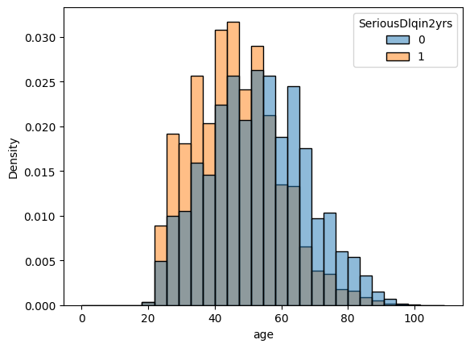
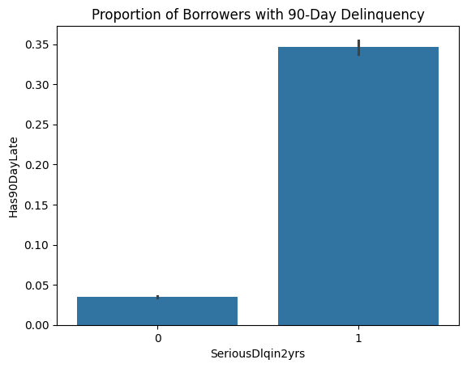

# Credit Risk Modeling and Default Prediction

## Overview

This project analyzes borrower-level financial data to identify key drivers of credit default risk and evaluate predictive model performance.

Using logistic regression, the model estimates the probability that a borrower will experience serious delinquency within two years.

👉 [View Full Report (Interactive Notebook)](https://nbviewer.org/github/hmaydata/credit-risk-analysis/blob/main/notebooks/credit_risk_analysis.ipynb)

## Visualizations

### Age Distribution

### Delinquency and Default Risk

## Objectives

* Identify key factors associated with default risk
* Build an interpretable predictive model
* Evaluate model performance using classification metrics
* Analyze tradeoffs between precision and recall

## Dataset

The dataset contains 150,000 borrower records with financial and behavioral variables such as:

* Credit utilization
* Delinquency history
* Income
* Number of credit lines

The target variable (`SeriousDlqin2yrs`) indicates whether a borrower defaulted within two years.

## Methodology

### 1. Exploratory Data Analysis

* Identified strong class imbalance (~6.7% default rate)
* Examined distributions of key variables
* Found that delinquency and utilization were strong signals

### 2. Data Cleaning & Feature Engineering

* Imputed missing values (income, dependents)
* Created delinquency indicator (`Has90DayLate`)
* Capped extreme utilization values
* Removed redundant variables

### 3. Modeling

* Logistic Regression (baseline model)
* Standardized features
* Train/test split (80/20)

### 4. Model Evaluation

| Metric    | Value |
| --------- | ----- |
| Accuracy  | 0.935 |
| Precision | 0.496 |
| Recall    | 0.158 |
| ROC AUC   | 0.84  |

### 5. Threshold Adjustment

Lowering the classification threshold from 0.5 to 0.2 improved recall:

| Metric    | Before | After |
| --------- | ------ | ----- |
| Precision | 0.496  | 0.420 |
| Recall    | 0.158  | 0.390 |

This highlights the tradeoff between identifying high-risk borrowers and minimizing false positives.

## Key Insights

* Past delinquency is the strongest predictor of default risk
* High credit utilization indicates financial stress
* Behavioral variables outperform demographic variables
* Threshold selection significantly impacts model performance

## Limitations

* Dataset may not reflect current economic conditions
* Missing macroeconomic context
* Static snapshot of borrower behavior

## Tools Used

* Python (pandas, numpy)
* scikit-learn
* matplotlib / seaborn

## Conclusion

The model demonstrates strong ability to distinguish between defaulters and non-defaulters (ROC AUC ~0.84).

Adjusting the classification threshold significantly improves the model’s ability to detect high-risk borrowers, highlighting the importance of aligning model decisions with business objectives.
